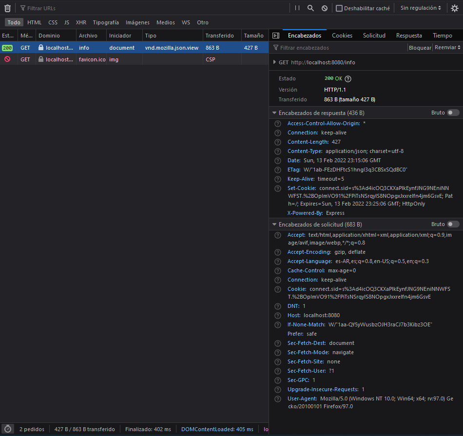
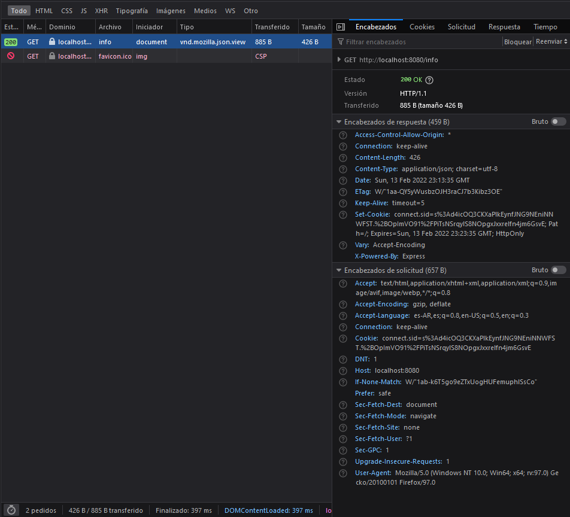

# Servidor con balance de carga
### DAMIÁN CABRIO

## Correr el proyecto localmente
Primero se debe instalar los paquetes desde npm con `npm i`
Para correr el proyecto localmente se debe correr el siguiente comando `npm run dev`. Si se quiere correr el proyecto con un puerto en particular se debe agregar a este comando el parámetro `-p puerto`. Por ejemplo `npm run dev -- -p 2000`.
El proyecto se puede correr en dos modos: Modo fork y modo cluster. Por defecto se utiliza el modo fork, para cambiar el modo utilizar el parámetro `-m` o `-mode` y el modo que se desea utilizar. Al usar el modo cluster, se creará un proceso por cada núcleo del CPU.

También se debe generar y popular un archivo .env, basándose en el archivo .env.example.
Las variables que se deben agregar al archivo .env son: `SESSION_SECRET`, `MONGODB_URL`, `FB_CLIENT_ID`, `FB_CLIENT_SECRET` y `FB_CALLBACK_URL`.

## Compresión gzip
Sé probo la ruta `/info` con y sin compresión, y estos fueron los resultados:
### Sin compresión

### Con compresión

## Logger
Se decidió emplear la biblioteca log4js para loguear la aplicación. El archivo de configuración se encuentra en `/src/services/logging.js` y los logs generados se pueden ver o por consola, o en el caso de los logs de nivel error y warning en la carpeta `logs`.

## Resultados de profiling
Los resultados del profiling de las rutas `/info` y `/api/random` realizados con node profiler y artillery se pueden encontrar en la carpeta `profiling`.